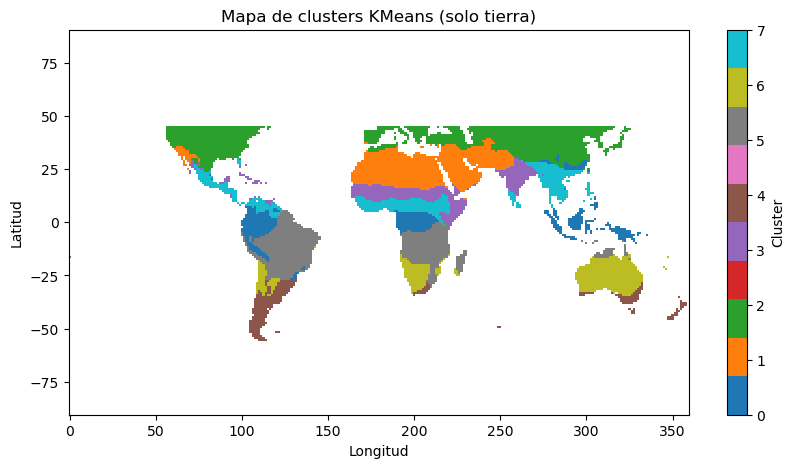

  

  <em>Mapa global de clasificación climática en 8 clusters — explicado en la sección de resultados.</em>

# Clustering Climático

Hemos creado una herramienta flexible para **análisis y clasificación de zonas climáticas** basada en datos multivariantes.  
Permite integrar múltiples **modelos climáticos o ambientales**, realizar su **preprocesamiento espacial y temporal**, y aplicar **reducción de dimensionalidad (PCA)** junto con **clustering (K-Means)** para identificar regiones con características similares.

En nuestro caso la hemos usado para detectar las zonas óptimas para la instalación de paneles solares pero su arquitectura modular es adaptable a cualquier tipo de análisis climático o ambiental, modificando las variables y fuentes de entrada.

---

## Objetivo
Construir una herramienta que nos permitiese:
- Combinar **datos de diferentes modelos climáticos** en un único conjunto coherente.
- Reducir su dimensionalidad mediante **PCA** para extraer los principales patrones de variación.
- Clasificar las regiones según su similitud climática mediante **K-Means**.
- Visualizar y exportar resultados para posibles usos futuros.

Una vez desarrollada la herramienta, la aplicamos a un caso de estudio centrado en la identificación de las zonas más idóneas del planeta para la instalación de paneles solares, utilizando un conjunto específico de variables y modelos climáticos seleccionados por su relevancia.

---

## Nuestro caso de estudio (instalación de paneles solares)

Los datos de los modelos CMIP6 utilizados se obtuvieron del repositorio oficial de la **Earth System Grid Federation (ESGF)**, disponible en [AIMS2 LLNL](https://aims2.llnl.gov/search/cmip6).

### Nuestra selección de variables

| Variable | Descripción | Unidad |
|-----------|--------------|--------|
| `rsds` | Radiación solar en superficie | W/m² |
| `clt` | Cobertura nubosa | % |
| `tas` | Temperatura media del aire | °K |
| `pr` | Precipitación media | kg m⁻² s⁻¹ |
| `sfcWind` | Velocidad del viento en superficie | m/s⁻¹ |

### modelos CMIP6 integrados
- ACCESS-CM2  
- ACCESS-ESM1-5  
- CESM2-WACCM  
- CMCC-CM2-SR5  
- FIO-ESM-2-0  
- MRI-ESM2-0  
- TaiESM1  

---

## Flujo de trabajo 

### 1. Unificación espacial
Los modelos suelen trabajar con rejillas diferentes por lo que realizamos un regridding para proyectarlos a una rejilla común definida por el usuario. (192 x 288 en nuestro caso)

### 2️.Ensemble de modelos
Genera un **ensemble promedio** de los modelos seleccionados, reduciendo el sesgo individual y la variabilidad extrema.

### 3️.Filtrado geográfico
Permite excluir regiones irrelevantes. (oceanos y polos en nuestro caso)

### 4️.Normalización y reducción
- Normaliza todas las variables a una escala comparable.
- Aplica PCA para condensar la información y facilitar el análisis multivariable.

### 5️.Clustering y clasificación
- Implementa K-Means.
- Compatible con otros algoritmos si se desea extender.

---

##  Resultados y visualización
Los resultados se exportan en formato NetCDF (.nc) para facilitar su análisis y reutilización en otras herramientas o plataformas geoespaciales.  

A continuación, se muestra el mapa resultante de la clasificación en **8 clusters climáticos**:

En este caso de estudio, el **cluster amarillo** fue identificado como la zona más idónea para la instalación de paneles solares, según un pequeño análisis complementario y conocimiento experto documentado en el archivo [`report.pdf`](report.pdf).

---

## Configuración inicial
En caso de usar el proyecto, es necesario crear una carpeta que almacene los diferentes modelos climáticos de entrada, por defecto busca `modelos/` en la raíz del repositorio pero se puede cambiar la ruta facilmente.  

En esta carpeta deben almacenarse los modelos, organizados en subcarpetas con el nombre de la variable (ej: `rsds`, `clt`, `tas`, `pr`, `sfcWind`).

